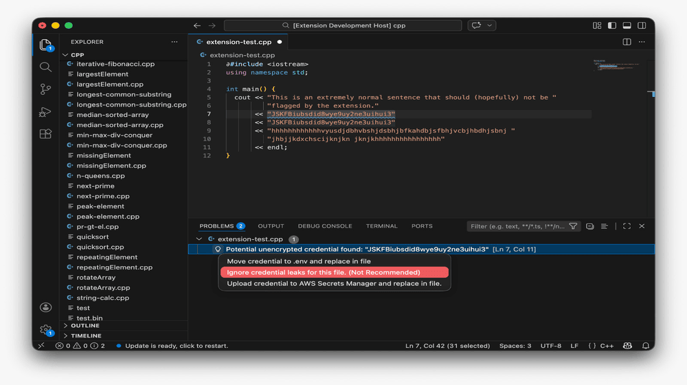

# code-scrubber website

Static promo site for the Code Scrubber VSCode extension.

## Structure

```
code-scrubber/
├── index.html          # Home page
├── docs.html           # Documentation
├── blog.html           # Blog
├── 404.html            # Not found
└── assets/
    ├── css/
    │   ├── base.css    # Variables, reset, shared utilities
    │   ├── nav.css     # Navbar
    │   ├── home.css    # Hero, features, carousel, about
    │   ├── docs.css    # Docs layout and sidebar
    │   ├── blog.css    # Blog cards and post view
    │   └── footer.css  # Footer
    ├── js/
    │   ├── theme.js    # Dark/light toggle (persists to localStorage)
    │   ├── nav.js      # Active link highlighting
    │   ├── carousel.js # Screenshot slider
    │   ├── docs.js     # Sidebar section switching
    │   └── blog.js     # Post open/close
    └── img/
        ├── screenshots/  # Drop real screenshots here
        └── og-image.png  # Social share image
```

## Deploy to GitHub Pages

1. Push this folder to your repo
2. Go to **Settings → Pages → Source** → set to `/ (root)` or `/docs`
3. Site goes live at `https://username.github.io/code-scrubber`

## Adding real screenshots

Replace the placeholder content inside each `.carousel-slide` in `index.html`:

```html
<!-- Before (placeholder) -->
<div class="carousel-slide">
  <div class="slide-icon">⊞</div>
  <div class="slide-title">PROBLEMS TAB VIEW</div>
  ...
</div>

<!-- After (real screenshot) -->
<div class="carousel-slide">
  
</div>
```

## Dark mode

Theme preference is saved to `localStorage` under the key `cs-theme`.
Toggled via the button in the nav on every page.
# code-scrubber_website
